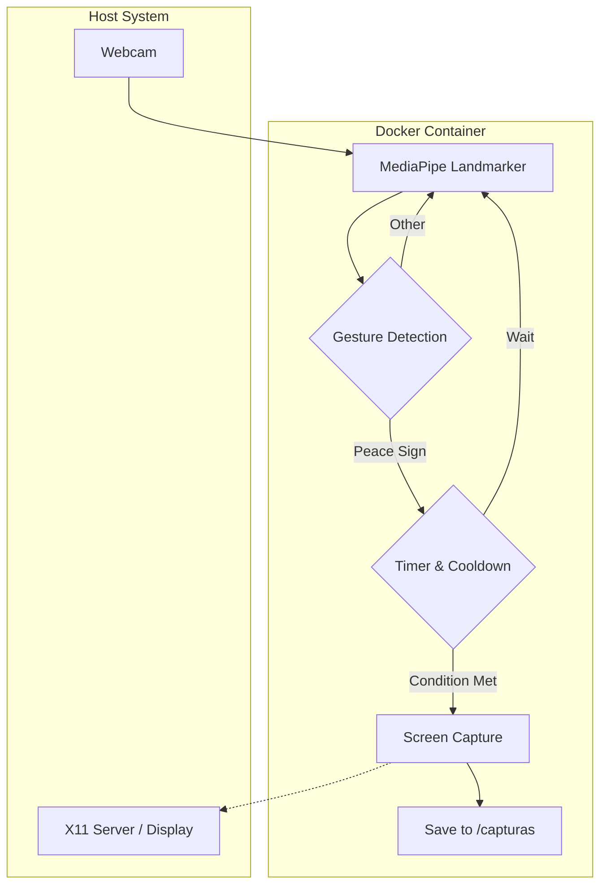

<p align="center">
  
</p>

<p align="center">
  <a href="#"></a>
  <a href="#"></a>
  <a href="#"></a>
</p>

| Branch | Version | Status |
| :--- | :--- | :--- |
| `main` | `1.0.0` |  |
| `develop` | `1.1.0-dev` |  |

| Platform | Docker | Python |
| :--- | :--- | :--- |
| Linux (x86_64) | `Latest` | `3.x` |
| macOS (ARM64) | `N/A` | `N/A` |
| Windows (x86_64) | `N/A` | `N/A` |

* **Docs:** [Enlace a documentación]
* **Website:** [Enlace a web]

## Introducción

Gesture Vision es una herramienta de automatización de grado de producción, desarrollada en Python y Docker para la captura de pantallas mediante el reconocimiento de gestos.

El sistema funciona mediante un pipeline de visión artificial donde MediaPipe procesa el flujo de la cámara para detectar puntos clave de la mano, disparando eventos de captura basados en patrones geométricos específicos. Esto proporciona el aislamiento de Docker con la eficiencia de procesamiento en tiempo real de MediaPipe.

## Arquitectura



## Características Principales

* **Rastreo de Alta Precisión:** Utiliza MediaPipe para la detección de landmarks manuales en tiempo real con baja latencia.
* **Control de Disparo Robusto:** Implementa un sistema de mantenimiento de gesto (1s) y cooldown (3s) para eliminar falsos positivos y spam de capturas.
* **Seguridad Interactiva:** Capa de consentimiento obligatoria al inicio para garantizar la autorización del usuario antes de habilitar la captura.
* **Despliegue Aislado:** Arquitectura basada en contenedores con mapeo de servidor X11 y dispositivos de video para una instalación sin dependencias en el host.

## Quick Start

```bash
# Clonar el repositorio y entrar al directorio
git clone <repo-url>
cd gesture-vision

# Construir e iniciar el contenedor
docker compose up --build
```

### Instrucciones de uso
1. **Permisos:** Haz clic en **"ACEPTAR"** en la ventana emergente para habilitar la cámara y el servidor gráfico.
2. **Gesto:** Realiza el signo de la paz (índice y medio extendidos) durante 1 segundo para capturar la pantalla.
3. **Cierre:** Presiona `q` en la ventana de video para salir.

## Estructura del Proyecto

- `main_x11.py`: Lógica central de detección y captura.
- `Dockerfile`: Configuración de entorno GL/EGL y dependencias de sistema.
- `docker-compose.yml`: Orquestación de volúmenes, dispositivos y entorno gráfico.
- `hand_landmarker.task`: Modelo pre-entrenado de MediaPipe.
