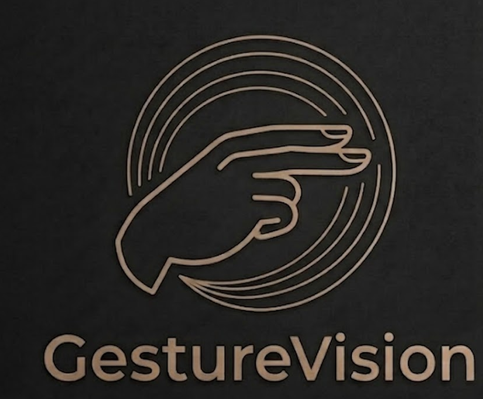
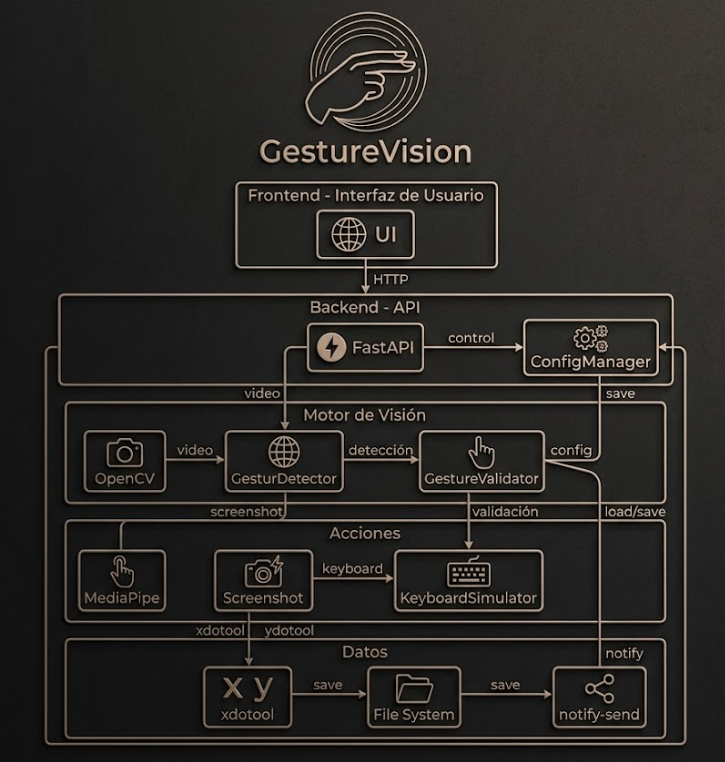

<p align="center">
  
</p>

<p align="center">
  <a href="#"></a>
  <a href="#"></a>
  <a href="#"></a>
</p>

| Branch | Version | Status |
| :--- | :--- | :--- |
| `master` | `0.3.0` |  |

| Platform | Python | System Dependencies |
| :--- | :--- | :--- |
| Linux (X11/Wayland) | `3.12+` | `libgl1`, `libglib2.0-0`, `notify-send`, `xdotool`, `ydotool` |
| macOS (ARM64) | `N/A` | `N/A` |
| Windows (x86_64) | `N/A` | `N/A` |

* **Docs:** [Enlace a documentación]

## Introducción

Gesture Vision es un sistema de control por gestos, desarrollado en Python para automatizar acciones del escritorio mediante el reconocimiento de gestos en tiempo real.

El sistema funciona mediante un pipeline de visión artificial donde MediaPipe procesa el flujo de la cámara para detectar puntos clave de la mano, coordinado por un backend asíncrono en FastAPI. Esto proporciona un control preciso de eventos con un impacto mínimo en los recursos del sistema.

## Arquitectura



## Características Principales

* **Rastreo de Alta Precisión:** Implementación de MediaPipe Hand Landmarker para la detección de puntos clave manuales con baja latencia.
* **Control de Disparo Robusto:** Sistema de validación basado en tiempo de mantenimiento del gesto y periodos de cooldown para eliminar falsos positivos.
* **Gestos de Barrido (Swipe):** Cambio de workspace con movimientos horizontales de la mano - izquierda/derecha.
* **Captura de Pantalla:** Detección del gesto de "paz" (índice y medio levantados) para tomar capturas.
* **Modo Invisible (Background):** Operación totalmente en segundo plano sin ventanas de previsualización, optimizando el uso de la GPU/CPU.
* **Atajos de Teclado:** Asocia gestos a atajos del sistema como ctrl+shift+q para ejecutar cualquier acción.
* **Soporte X11 y Wayland:** Detecta automáticamente si usar xdotool (X11) o ydotool (Wayland).
* **Notificaciones Nativas:** Integración con el sistema de alertas del escritorio para confirmar acciones instantáneamente.
* **Despliegue Nativo:** Instalación simplificada vía `pip` con comandos CLI dedicados para la gestión del servicio.
* **Panel Web:** Interfaz gráfica para configurar gestos, atajos y tiempos.

## Quick Start

### 1. Instalación
```bash
# Instalar desde PyPI
pip install gesturevision
```

### 2. Ejecución
```bash
# La primera vez: instala dependencias del sistema automáticamente
gesturevision-start --install-deps

# Iniciar el sistema
gesturevision-start
```

### 4. Panel de Control
Acceda al panel web: **http://localhost:8080**

Allí podrá:
- Iniciar/detener el sistema
- Configurar tiempos de gesto y cooldown
- Agregar gestos y asociar atajos de teclado

## Tipos de Gestos Disponibles

| Gesto | Descripción |
| :--- | :--- |
| ✌️ **Paz** | Índice y medio arriba |
| ✊ **Puño** | Mano cerrada |
| ✋ **Mano abierta** | 5 dedos extendidos |
| 👍 **Tres dedos** | Índice, medio y anular arriba |
| ☝️ **Apuntar** | Solo índice arriba |

## Atajos de Teclado Soportados

 Puede usar cualquiera de los atajos predefinidos o escribir el propio:

- Captura de pantalla: `Print`
- Cerrar ventana: `alt+F4`
- Minimizar todo: `super+d`
- Bloquear pantalla: `super+l`
- Cambiar ventana: `alt+Tab`
- Nueva pestaña: `ctrl+t`
- Cerrar pestaña: `ctrl+w`
- Copiar/Pegar: `ctrl+c` / `ctrl+v`
- Y muchos más...

## Estructura del Proyecto

- `src/gesturevision/main_vision.py`: Motor de detección de gestos y captura.
- `src/gesturevision/api/`: Backend FastAPI para control y configuración.
- `src/gesturevision/static/`: Interfaz de usuario del panel de control.
- `pyproject.toml`: Definición de dependencias y entry points del paquete.
- `gesturevision/assets/hand_landmarker.task`: Modelo de IA pre-entrenado.

## Configuración

Los ajustes se almacenan en: `~/gesturevision/config.json`

Estructura:
```json
{
  "gesture_hold_seconds": 1.0,
  "cooldown_seconds": 1.5,
  "gestures": [
    {
      "name": "Paz (captura)",
      "gesture_type": "peace_sign",
      "required_hold_seconds": 1.0,
      "enabled": true,
      "action": "screenshot",
      "shortcut": null
    }
  ]
}
```

## Docker (Opcional)

```bash
docker-compose up --build
```

Acceda al panel en: **http://localhost:8080**